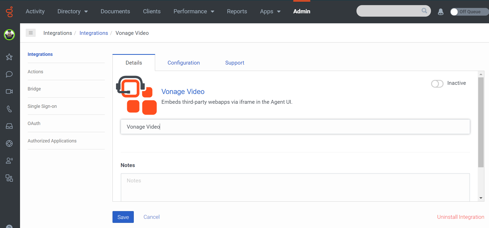
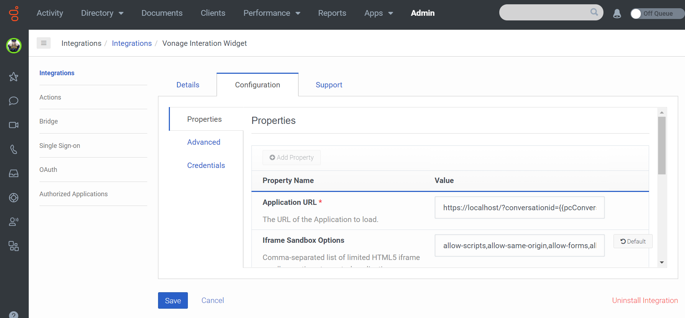
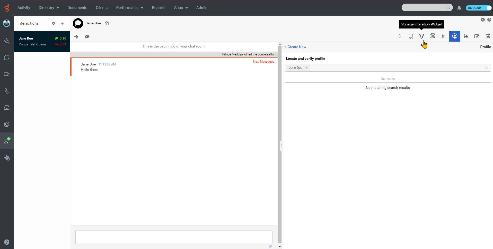
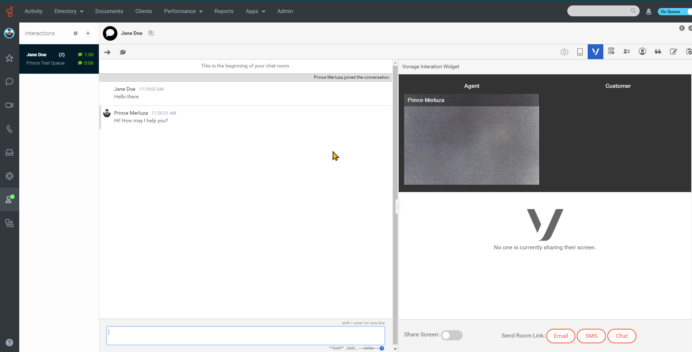
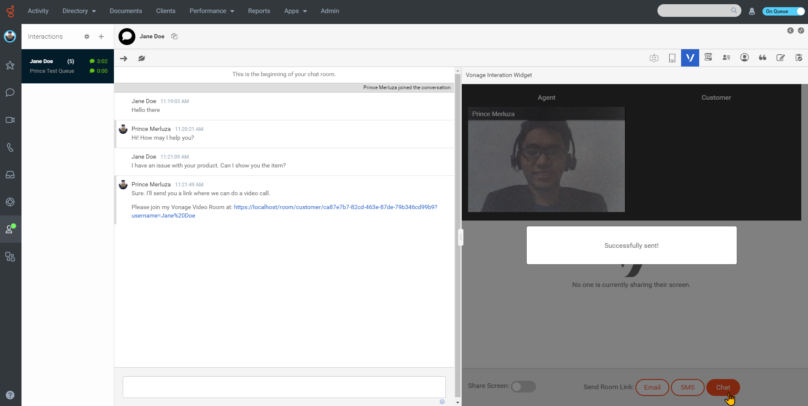
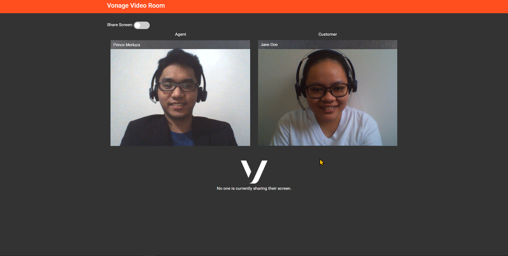

:::{"alert":"primary","title":"About Genesys Cloud Blueprints","autoCollapse":false} 
Genesys Cloud blueprints were built to help you jump-start building an application or integrating with a third-party partner. 
Blueprints are meant to outline how to build and deploy your solutions, not a production-ready turn-key solution.
 
For more details on Genesys Cloud blueprint support and practices 
please see our Genesys Cloud blueprint [FAQ](https://developer.genesys.cloud/blueprints/faq)sheet.
:::


This Genesys Blueprint provides instructions for deploying Vonage Video on Genesys Cloud. The Vonage Video API (formerly TokBox OpenTok) makes it easy to embed high-quality interactive video, voice, messaging, and screen sharing into web and mobile apps. For more info on how the video platform works, check out [Video API Basics](https://tokbox.com/developer/guides/basics/).

Genesys Cloud uses **Interaction Widget** to provide customers with a Vonage Video interaction.


## Sample Application Features

- **Interaction Widget** - Uses the Genesys Cloud's Interaction Widget to enable the agent to start a Vonage room inside Genesys Cloud.
- **Start Vonage rooms** - Allows an agent to start a Vonage room from Genesys Cloud.
- **Send Vonage Invite** - Sends the invite or room link to a customer via Chat, SMS or email.
- **Multiple Interaction Support** - Supports multiple interactions from different interaction channels in Genesys Cloud.
- **Screen Share** - Utilizes the screen share functionality of the Vonage Video API to allow the agent and/or the customer to share their screen.
- **Save Session ID** - Adds a note in the Genesys Cloud interaction detail to save the Vonage Video's session ID.

## Solution components

- **Genesys Cloud** - The Genesys cloud-based contact center platform. Genesys Cloud is the platform for the Vonage Video solution.
- **Genesys AppFoundry** - The Genesys AppFoundry is an app marketplace for solutions that run on the Genesys Cloud platform. You get the Vonage Video integration used in the solution from the Genesys AppFoundry.
- **Interaction Widget Integration** - This integration type enables web apps to be embedded in an iframe within Genesys Cloud. Each iframe is unique to an interaction and will only show when the interaction is being offered or received by an agent. The client app for this blueprint will be embedded via this integration type.
- **Vonage** - Vonage is a telecommunications service provider based on voice over Internet Protocol (VoIP).
- **Vonage Video API platform** - This platform makes it easy to embed real-time high quality interactive video, messaging, screen-sharing and more into web ang mobile applicaitons. The platform includews client libraries for web, iOS, Andriod and Windows as well as server-side SDKs and REST API. The Vonage Video API uses WebRTC for audio-video communications.
- **NodeJS App and Web Server** - Vonage Video API applications requires both a client and server component. The server component generates new sessions and tokens which it sends to the client. This blueprint includes a script that will run the Web Server which provides the client pages and the Vonage App server which uses the Vonage Video NodeJS Server SDK.

### Software Development Kit (SDK)

- **Genesys Cloud Platform API SDK** - This SDK is used for the initial interaction of agent and customer over chat, SMS and email channels.
- **Genesys Cloud Client App SDK** - This SDK allows the client app to subscribe to lifecycle hooks of the integration and invoke functions accordingly.
- **Vonage Video Client Web SDK** - This SDK is used to create and start a Vonage Video room for the agent and customer to have a video interaction with screen sharing.
- **Vonage Video Server NodeJS SDK** - This SDK is used to generate sessions and tokens.

## Requirements

### Specialized knowledge

Implementing this solution requires experience in several areas or a willingness to learn:

- Administrator-level knowledge of Genesys Cloud and the Genesys AppFoundry
- Genesys Cloud Platform API knowledge
- Vonage Video API knowledge

### Genesys Cloud account requirements

This solution requires a Genesys Cloud license. For more information on licensing, see [Genesys Cloud Pricing](https://www.genesys.com/pricing "Opens the pricing article").

A recommended Genesys Cloud role for the solutions engineer is Master Admin. For more information on Genesys Cloud roles and permissions, see the [Roles and permissions overview](https://help.mypurecloud.com/?p=24360 "Opens the Roles and permissions overview article").

### Vonage account requirements

This solution requires a Vonage Video license. To sign up for a Vonage Video account, see [here](https://tokbox.com/account/user/signup?icid=tryitfree_comm-apis_tokboxfreetrialsignup_nav).

The solutions engineer requires a Vonage Video account to create a project and generate a Project API Key and Project Secret.

## Run Locally

The Vonage Video integration has the following stages:

- Download the repository containing the project files.
- Create a Client Credentials OAuth Grant for Genesys Cloud.
- Create or use existing Vonage Video API credentials.
- Host and run the NodeJS app server.
- Install and activate the Vonage Video integration app on Genesys Cloud.
- Create a Genesys web chat widget and test the Vonage Video solution.

### Download the repository containing the project files

1. Go to the [repository](https://github.com/GenesysAppFoundry/genesyscloud-vonage) and clone it to your machine.

### Create an Implicit Grant OAuth

1. Login to your Genesys Cloud organization and create a new OAuth Credential (Implicit Grant). [Create an OAuth Client](https://help.mypurecloud.com/articles/create-an-oauth-client/)
2. Add **https://localhost/** to the **Authorized redirect URIs**. Note: If you've changed the **redirecUri** value in the config file, then you need to add that new URI instead.
3. In the Scope section, add **users**, **conversations** and **notifications**.
4. Take note of the Client ID. It will be used in the configuration of the project.

### Create a Client Credentials OAuth Grant for Genesys Cloud

1. Login to your Genesys Cloud organization and create a new OAuth Credential (Client Credentials Grant). [Create an OAuth Client](https://help.mypurecloud.com/articles/create-an-oauth-client/)
2. Select all of the admin **roles** for the OAuth client.
3. Take note of the Client ID and Client Secret.

### Create or use existing Vonage Video API credentials

1. Create or open an existing Vonage Video project from your Vonage account. The project needs to be a Custom Project (OpenTok API) and not an Embed Project.
2. Take note of the Project API Key and Project secret.

### Create a configuration file

1. In the project directory, make a copy of the [sample-config.js](https://github.com/MyPureCloud/vonage-video-blueprint/blob/master/sample-config.js) file and rename it to **config.js**.
2. Enter the values required in the file.

### (Optional) Set up an Email Queue for email invitations

If you want to send invitations to the Vonage Video Room via email, then a queue is required.
For more information about queues and how to create them, read this [article](https://help.mypurecloud.com/articles/queues/).

1. Once you have a queue, take note of the queue ID. It can be found using an [API query](https://developer.mypurecloud.com/api/rest/v2/routing/index.html) or if using the Genesys Cloud UI, in the URL.

2. Enter the Queue ID into the config file.

NOTE: Make sure that agents who access the interaction widget are also members of the queue.

### (Optional) Purchase SMS number for SMS invitations

If you want to send invitations to the Vonage Video Room via SMS, then a dedicated SMS number is required.

For more details on purchasing SMS numbers, read this [article](https://help.mypurecloud.com/articles/purchase-sms-numbers/).

1. Once you have a dedicated SMS number, enter the address into the config file.

### Run the NodeJS web server

The project contains two NodeJS scripts:

1. web-server.js - web server powered by Express.js. Serves the web app over localhost (https).
2. vonage-server-app.js - a module for the web server script. Contains the logic for creation of Vonage sessions, tokens, and confirmation on whether a Genesys Cloud conversation is active or not.

Open a terminal in the project directory and run the server by entering:

```
npm run start-server
```

### Setup an Interaction Widget integration in Genesys Cloud

1. Login to your Genesys Cloud organization and add a new **Integration**.


2. Install the Interaction Widget.


3. (Optional) Use the Name box to give the app a different name.



4. Click the **Configuration Tab**. If you're testing the project out of the box, type in the URL:

```
https://localhost/?conversationid={{pcConversationId}}&language={{pcLangTag}}&environment={{pcEnvironment}}
```

In the Iframe Sandbox Options, enter the following:

```
allow-forms,allow-modals,allow-popups,allow-presentation,allow-same-origin,allow-scripts,allow-downloads
```

In the Iframe Feature/Permissions Policy, enter the following:

```
camera,microphone,geolocation,clipboard-write,display-capture,fullscreen 
```

Select a group for filtering user access to the widget.

Select specific queues for widget access.

Select the ACD interaction types where you want the widget to be available for.

5. Go to **Advanced** Configuration and enter this in the text area:

```json
{
  "lifecycle": {
    "ephemeral": false,
    "hooks": {
      "stop": true,
      "focus": true,
      "blur": true,
      "bootstrap": true
    }
  },
  "icon": {
    "48x48": "https://github.com/GenesysAppFoundry/genesyscloud-vonage/raw/master/public/img/logo-48x48.png",
    "24x24": "https://github.com/GenesysAppFoundry/genesyscloud-vonage/raw/master/public/img/logo-24x24.png",
    "96x96": "https://github.com/GenesysAppFoundry/genesyscloud-vonage/raw/master/public/img/96x96.png",
    "128x128": "https://github.com/GenesysAppFoundry/genesyscloud-vonage/raw/master/public/img/128x128.png",
    "256x256": "https://github.com/GenesysAppFoundry/genesyscloud-vonage/raw/master/public/img/256x256.png"
  },
  "monochromicIcon": {
    "vector": "https://github.com/GenesysAppFoundry/genesyscloud-vonage/raw/master/public/img/vonage-logo.svg"
  }
}
```

6. **Save** and **Activate** the integration.



## Testing the solution using Genesys Cloud Web Chats Developer Tool

1. Create a Genesys web chat widget if you haven't already. [Create a widget for web chat](https://help.mypurecloud.com/?p=195772).
2. Go to Genesys Cloud [Developer Tools](https://developer.mypurecloud.com/developer-tools/#/webchat).
3. Select your deployment and queue and initiate a chat interaction.

Once the agent is offered/answers the incoming interaction, they should see the Vonage panel in one of the Agent tools section.




Clicking it will take them to a Vonage room. The agent could then invite the customer by sending the link through 3 different channels: SMS, Email, or Chat (If the conversation is a chat interaction).






Client view of the room:



The agent or the customer could initiate screen sharing of their devices.


## Troubleshooting

For troubleshooting information, see the [Vonage Video Troubleshooting](https://support.tokbox.com/hc/en-us/sections/360004890311-Troubleshooting).

## Additional Resources

- [Genesys Cloud Developer Center](https://developer.mypurecloud.com/)
- [Genesys Cloud Platform Client SDK](https://developer.mypurecloud.com/api/rest/client-libraries/)
- [Vonage Developer Center](https://www.vonage.com.ph/developer-center/?icmp=mainnav_developercenter_novalue)
- [Vonage Video Client SDK](https://tokbox.com/developer/sdks/js/)
- [Vonage Video Server SDK](https://tokbox.com/developer/sdks/server/)
